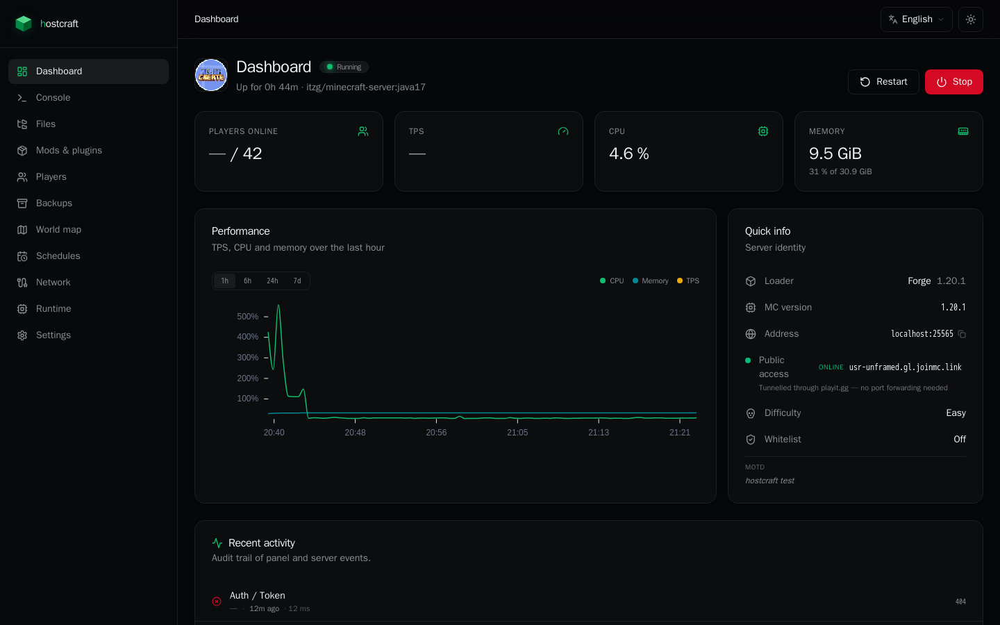
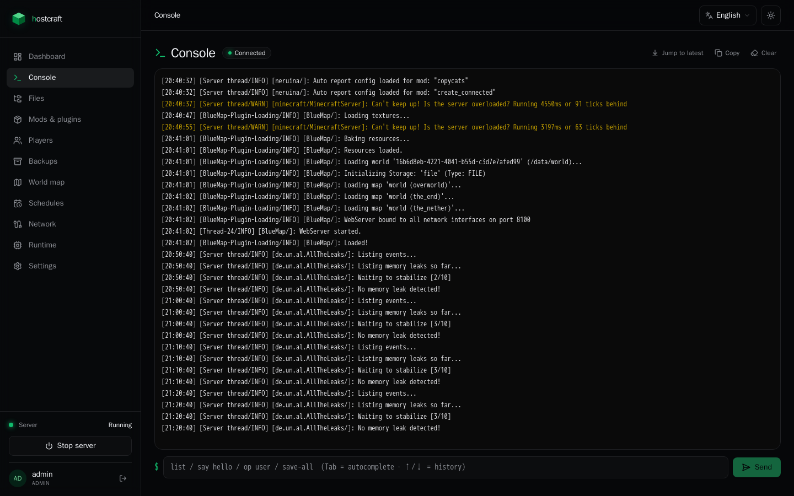
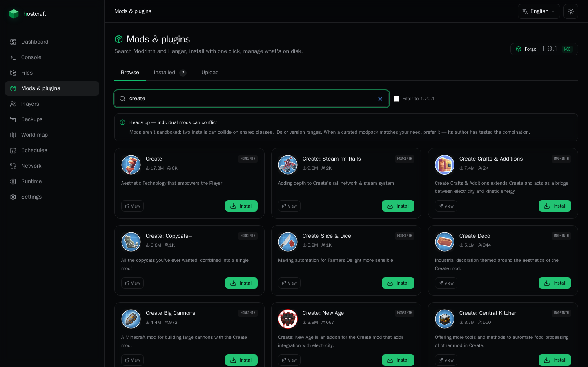
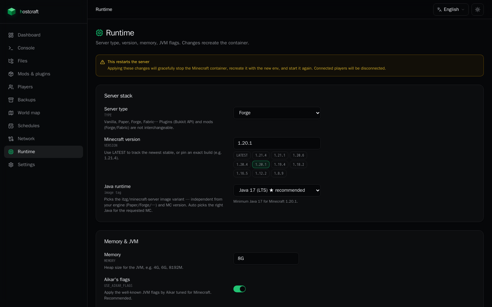
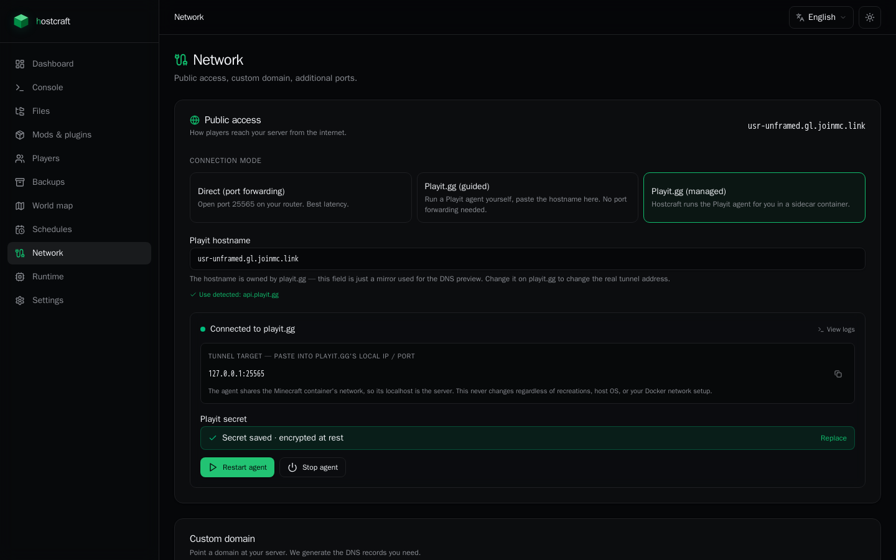

<div align="center">

# hostcraft

**A self-hosted web panel for your own Minecraft server.**
Single Compose stack. Vue 3 + Django. Open source, MIT.

[](https://github.com/e-scheer/hostcraft/actions/workflows/ci.yml)
[](LICENSE)
[](https://github.com/e-scheer/hostcraft/pkgs/container/hostcraft)
[](#status)

</div>

---

## What it is

Hostcraft is a web UI to run **one** Minecraft server — the container running next to it. You bring the host, it brings the panel: live console, world map, mod/plugin marketplace, file editor, automated backups, optional Playit tunnel, Java version picker, the lot.

It is *not* a Pterodactyl alternative. There's no multi-tenant, no billing, no ticketing. It's a single-instance panel built for one use case: **running a private server for you and your friends, without paying €15/month for a hosted panel that hides what your machine is actually doing.**

```bash
git clone https://github.com/e-scheer/hostcraft
cd hostcraft
cp .env.example .env       # set DJANGO_SECRET_KEY + MC_RCON_PASSWORD + admin password
docker compose up -d
open http://localhost:8080
```

That's the whole install. Everything else is configured from the UI.

## Screenshots

<table>
  <tr>
    <td width="33%"></td>
    <td width="33%"></td>
    <td width="33%"></td>
  </tr>
  <tr>
    <td align="center"><sub><b>Dashboard</b> — server vitals, public-access status, recent activity</sub></td>
    <td align="center"><sub><b>Console</b> — xterm.js terminal, Tab-completion on MC commands, copy/jump-to-latest</sub></td>
    <td align="center"><sub><b>Marketplace</b> — unified Modrinth + Hangar search, version-aware install</sub></td>
  </tr>
  <tr>
    <td></td>
    <td colspan="2"></td>
  </tr>
  <tr>
    <td align="center"><sub><b>Runtime</b> — engine, Java image, memory & flags with compat warnings</sub></td>
    <td colspan="2" align="center"><sub><b>Network</b> — direct port forwarding or Playit.gg (guided/managed), tunnel target preview, hostname auto-detection</sub></td>
  </tr>
</table>

## Status

> [!WARNING]
> **This is an early personal project, not a hardened product.**
> Expect rough edges, breaking changes between commits, and the occasional "why is my world gone" moment. I built it for my own server-with-friends; I'm sharing it because nothing else fits this niche and you might enjoy hacking on it with me.
>
> If you're considering it for a public server, **don't yet**.

Bug reports and pull requests are very welcome — this is the kind of project that gets better fast with one or two extra people poking at it. See [Contributing](#contributing).

## Why it exists

Every public panel I looked at was either built for hosts who resell servers (Pterodactyl, Pelican) — which is *enormous* for someone who just wants to host MC for five friends — or paid-only with rough UX. The self-hosted gap was:

- one server, one panel, side-by-side
- modern, responsive UI that doesn't look like 2014
- mods + plugins in the same search (Modrinth + Hangar)
- console with actual command/reply correlation, not log-tail-and-pray
- one-click BlueMap and Playit tunneling
- everything containerised — no `apt install` on the host, no Python venv juggling

So I built it. It runs on my single Intel NUC at home; it should run on yours too.

## Features

What works today:

- **Live console** — xterm.js terminal with WebSocket streaming, Tab autocomplete for vanilla + Paper commands, RCON request/reply correlation, jump-to-latest, copy-to-clipboard.
- **Mod & plugin marketplace** — unified search across Modrinth and Hangar, version-aware (filters by your MC version + loader family), upload tab for manual `.jar` / `.mrpack` / `.zip` CurseForge serverpacks.
- **World map** — one-click BlueMap install, loader-aware: picks the right BlueMap major for your Java version so it actually loads.
- **Runtime tuning** — engine swap (Paper ↔ Forge ↔ Fabric), MC version, Java image, memory, JVM flags. With safety: backup before risky changes, full data-dir wipe on engine swap, recommended-Java hint with ★ badge.
- **Network** — direct port forwarding, Playit.gg in two modes (guided: you run the agent / managed: panel runs a sidecar container sharing the MC network namespace). Hostname is auto-detected via the playit.gg API.
- **Settings** — visual editors for `server.properties`, `ops.json`, `whitelist.json`.
- **Files** — code-mirror file browser for the MC data dir.
- **Backups** — on-demand or scheduled; restore from any snapshot.
- **i18n** — French and English (full parity), feature-complete UI strings.
- **Audit log** — every panel action recorded with actor + result.

What's coming:
- multi-version Java profiles per modpack
- richer mob/inventory dashboards from RCON data
- one-click Geyser/Floodgate setup
- hibernation with wake-on-connect

What's not on the roadmap:
- multi-server hosting
- user billing
- in-game ticket system

## Architecture

Two containers, one shared volume.

```
┌─────────────────────┐         ┌──────────────────────┐
│  hostcraft  (8080)  │ ──RCON─►│  itzg/minecraft-     │
│  Django + Vue SPA   │ ─socket►│  server  (25565)     │
└─────────────────────┘         └──────────────────────┘
         │                              ▲
         └──────── shared /data ────────┘
                      │
                ┌─────┴──────┐
                │ docker-    │
                │ socket-    │
                │ proxy      │
                └────────────┘
```

- The panel talks to Docker via [`tecnativa/docker-socket-proxy`](https://github.com/Tecnativa/docker-socket-proxy) — locked-down endpoint allowlist (`CONTAINERS=1 NETWORKS=1 IMAGES=1 POST=1`). The panel never sees the raw socket.
- RCON over TCP for in-game commands (persistent socket, pooled, auto-reconnect).
- Shared volume mounted in both containers so the panel can read/write mods, configs, world data.
- Playit "managed" mode spawns a third container using `network_mode: container:<mc>` so the agent's localhost *is* the MC server — portable across NAT, Tailscale, corporate networks.

## Stack

| Layer | Tech |
|---|---|
| Backend | Django 5 · DRF · SimpleJWT · Channels (ASGI) · WhiteNoise · SQLite · Argon2 |
| Frontend | Vue 3 · Vite · TypeScript · Pinia · Vue Router · TanStack Query/Table/Virtual · Tailwind v4 · Reka UI · xterm.js |
| Container runtime | Docker SDK for Python · `itzg/minecraft-server` · `tecnativa/docker-socket-proxy` · `ghcr.io/playit-cloud/playit-agent` |
| Mod sources | Modrinth API v2 · Hangar API · Mojang piston-meta |

## Container image

Multi-arch (`linux/amd64`, `linux/arm64`) image, published on every `vX.Y.Z` git tag — main-branch builds are validated by CI but not pushed, so the registry only ever holds versioned releases.

```bash
docker pull ghcr.io/e-scheer/hostcraft:latest
# or pin a release
docker pull ghcr.io/e-scheer/hostcraft:v0.1.0
```

The published `docker-compose.yml` pulls from GHCR by default. If you'd rather build locally, swap `image:` for `build:` in the `hostcraft` service.

## Development

```bash
make dev          # docker compose -f docker-compose.dev.yml up
make dev-down     # clean stop (incl. dynamic sidecars)
```

Frontend hot-reloads at `:5173`. Backend reloads at `:8001`. Both bind-mount source so you edit on the host and changes hit instantly.

- Backend tests: `docker compose -f docker-compose.dev.yml exec backend python manage.py test`
- Frontend type-check: `docker compose -f docker-compose.dev.yml exec frontend npx vue-tsc --noEmit`
- Frontend lint: `docker compose -f docker-compose.dev.yml exec frontend npm run lint`

No host tooling required — no Python, no Node, no virtualenv on your machine. Everything runs in containers.

## Security defaults

- All panel containers run as non-root (UID 1000).
- Docker socket is never exposed directly to the panel — fronted by docker-socket-proxy with a minimal endpoint allowlist.
- `cap_drop: [ALL]`, `no-new-privileges`, `read_only` filesystem on the panel container (writeable tmpfs for `/tmp` only).
- Passwords hashed with Argon2.
- `DJANGO_SECRET_KEY` / `MC_RCON_PASSWORD` are required env — no default fallback that ships to production.

If you find a security issue, please open a [private security advisory](https://github.com/e-scheer/hostcraft/security/advisories/new) rather than a public issue.

## Contributing

This is exactly the kind of project that benefits from a second pair of eyes. Areas where I'd love help:

- **More mod sources** — CurseForge proper, Spigot, GitHub releases.
- **Better tests** — backend has scaffolding but coverage is thin.
- **Engine-specific quirks** — every loader (Forge / NeoForge / Fabric / Quilt / Paper / Purpur / Folia) has its own surprises. Bug reports with crash logs are gold.
- **Translations** — FR + EN today. PRs for other languages welcome (see `frontend/src/locales/`).

Open an issue first if it's a feature; just send a PR if it's a fix. There's no CLA. By contributing you agree your work is MIT-licensed.

Code style: backend uses Django conventions + type hints; frontend uses Vue 3 Composition API + TS strict. ESLint and `vue-tsc` are run in CI — they need to pass.

See [CONTRIBUTING.md](CONTRIBUTING.md) for the dev-loop walkthrough.

## License

[MIT](LICENSE) — do what you want, just don't blame me if it eats your world file.

## Acknowledgements

This panel stands on the shoulders of:
- [`itzg/minecraft-server`](https://github.com/itzg/docker-minecraft-server) — the actual MC container. Most of the "it just works" magic is theirs.
- [BlueMap](https://bluemap.bluecolored.de/) — the web map.
- [playit.gg](https://playit.gg/) — the tunneling.
- [Modrinth](https://modrinth.com/) and [Hangar](https://hangar.papermc.io/) — the mod/plugin APIs.

Without them this would be ten times more code and half as good.
